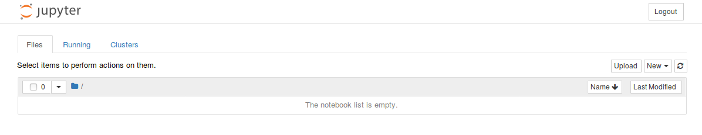
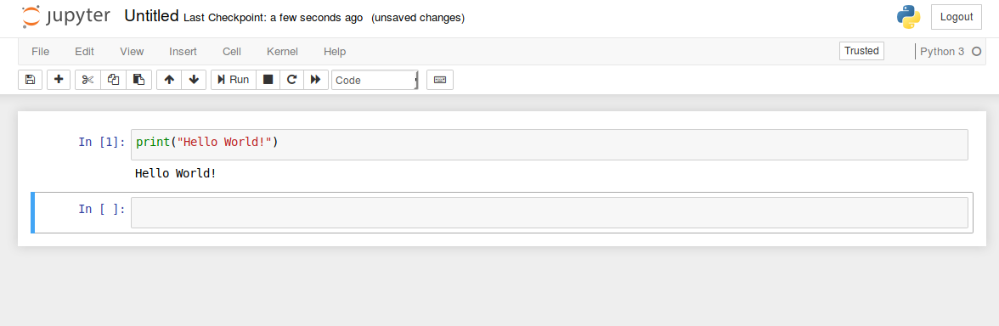
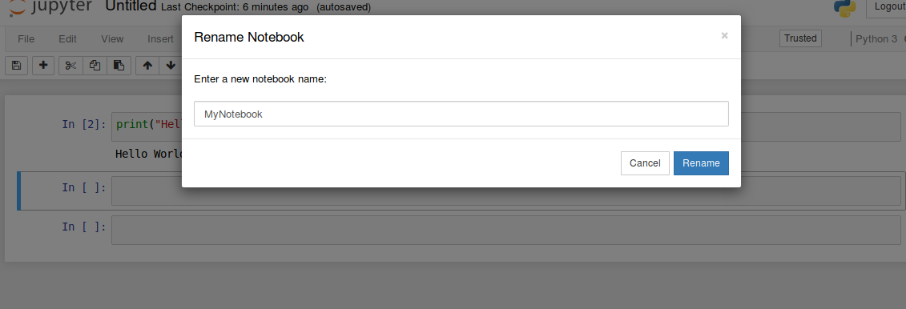
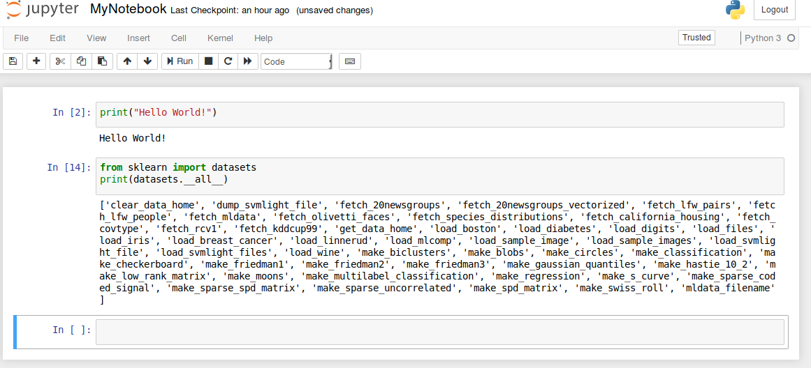
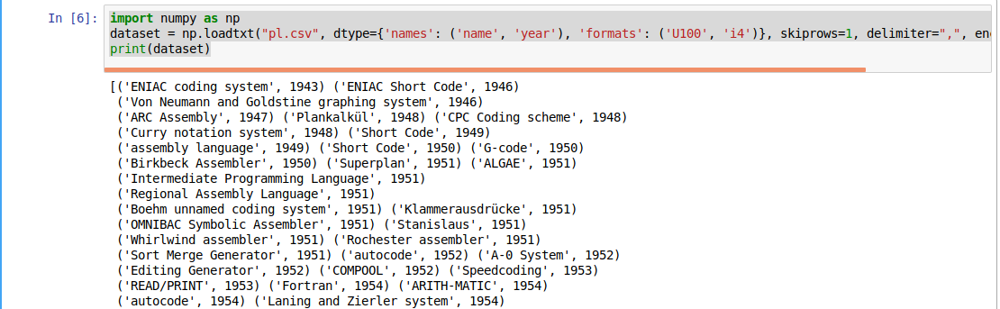
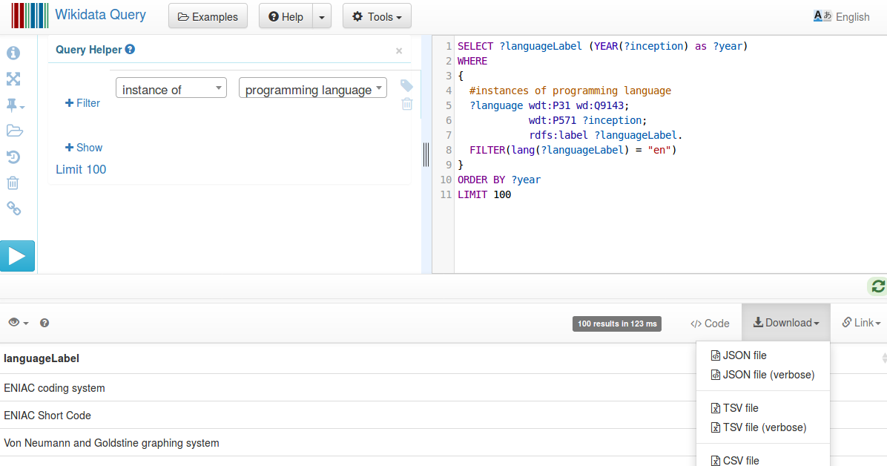

### Goals

-   Parsing and working with CSV, TSV and JSON files
-   Querying external data sources
-   Data analyses

#### Exercises

1.  Installation and setting up of pip, scikit-learn and jupyter
2.  Parsing and reading CSV/TSV files
3.  Parsing and reading JSON files
4.  Querying external data sources (Query endpoints and API)
5.  Performing classical data analyses

#### Exercise 1.1


##### Installation

Run the following commands on your virtual machines

pip

``` 
            
$ sudo apt update

$ sudo apt install python3-dev 

$ sudo apt install python3-pip
            
          
```

Installation of virtualenv

``` 
            
$ sudo apt install virtualenv
            
          
```

Installation inside virtualenv

``` 
            
$ virtualenv --system-site-packages -p python3 env

          $ source env/bin/activate
            
          
```

Installation of jupyter

``` 
            
     $ python3 -m pip install --upgrade --force-reinstall  --no-cache jupyter 
            
          
```

Installation of scikit-learn

``` 
            
$ python3 -m pip install scikit-learn
            
          
```

Installation of numpy

``` 
            
$ python3 -m pip install numpy
            
          
```

Installation of pandas

``` 
            
$ python3 -m pip install pandas
            
          
```

Installation of matplotlib

``` 
            
$ python3 -m pip install matplotlib
            
          
```

##### Hello World!

If your installation is successful, you can run

``` 
            
$ mkdir TP1 && cd TP1
$ jupyter notebook
            
          
```

A new page will appear on your browser and you will see the following
image 

Click on the tab \'Running\'. You see no notebooks running (if it\'s the
first time you are running jupyter).


Go back to the \'Files\' tab and click on New and choose Python3 under
Notebook 

A new tab will open as shown below. Write the following code in the cell

``` 
            
print("Hello World!")
            
          
```



You can go to any cell and press \'Run\'

By default, your Notebook is named \'Untitled\'. You can rename it as
shown below, by clicking on the name \'Untitled\' and by giving a new
name.



Now go back to the \'Files\' tab and you can see the renamed notebook.
You can click on your notebook at any time to continue working.


Now let\'s continue working on your current Notebook. Write the
following code to check whether scikit is properly installed.

The code below shows the available datasets from scikit.

``` 
            
from sklearn import datasets

print(datasets.__all__)
            
          
```



Now, you are ready to go!!

**Note:**, You can stop Jupyter notebook at any point by typing
\"Ctrl+c\" on the terminal and by pressing \'y\' to confirm shutdown.

Practise the (optional) exercises given in [practicals
0](./practicals0.html).


#### Exercise 1.2


Most of the time, we work with CSV (comma-separated values) files for
data analysis. A CSV file consits of one or more lines and each line has
one or more values separated by commas. One can consider every line as a
row and every value in a row as a column value. The first row is
sometimes used to describe the column names.

Copy the file
[pl.csv](../../data/pl.csv) to
your current working directory (where you are running Jupyter: TP1) and
use the following code to parse the csv file. Note the column names and
datatypes (U100, i4)

``` 
            
import numpy as np 
dataset = np.loadtxt("pl.csv", dtype={'names': ('name', 'year'), 
    'formats': ('U100', 'i4')}, 
   skiprows=1, delimiter=",", encoding="UTF-8") 
print(dataset)
            
          
```



[CSV support in
numpy](https://docs.scipy.org/doc/numpy/reference/generated/numpy.loadtxt.html)
(**Ref:**
[https://docs.scipy.org/doc/numpy/reference/generated/numpy.loadtxt.html])
is different from Python\'s default [CSV
reader](https://docs.python.org/3.5/library/csv.html) (**Ref:**
[https://docs.python.org/3.5/library/csv.html])
because of its capability to support the [data
types](https://docs.scipy.org/doc/numpy/reference/arrays.dtypes.html)
(**Ref:**
[https://docs.scipy.org/doc/numpy/reference/arrays.dtypes.html]).
Before continuing, take a deep look at
[numpy.loadtxt](https://docs.scipy.org/doc/numpy/reference/generated/numpy.loadtxt.html)
(**Ref:**
[https://docs.scipy.org/doc/numpy/reference/generated/numpy.loadtxt.html]).

\

Copy the file
[pl.tsv](../../data/pl.tsv) to
your current working directory and use the following code to parse the
tsv file.

``` 
            
import numpy as np 
dataset = np.loadtxt("pl.tsv", dtype={'names': ('name', 'year'), 
    'formats': ('U100', 'i4')}, 
   skiprows=1, delimiter="\t", encoding="UTF-8") 
print(dataset)
            
          
```

Note the changes in the above code compared to the previous one. A TSV
file is a tab-separated file, i.e., the column values are separated by a
tab ([\\t]).


#### Exercise 1.3


Most of the external data sources may provide their data in JSON format.
Our next exercise is to parse JSON files. Copy the file
[pl.json](../../data/pl.json) to
your current working directory and use the following code to parse the
JSON file. In this exercise, we use [Pandas python
package](https://pandas.pydata.org/pandas-docs/stable/) (**Ref:**
[https://pandas.pydata.org/pandas-docs/stable/]) to
parse the JSON file to obtain a [Pandas DataFrame](https://pandas.pydata.org/pandas-docs/stable/generated/pandas.DataFrame.html)
(**Ref:**
[https://pandas.pydata.org/pandas-docs/stable/generated/pandas.DataFrame.html]).
Try using methods like
[transpose](https://pandas.pydata.org/pandas-docs/stable/generated/pandas.DataFrame.transpose.html#pandas.DataFrame.transpose)
(**Ref:**
[https://pandas.pydata.org/pandas-docs/stable/generated/pandas.DataFrame.transpose.html\#pandas.DataFrame.transpose]),
[count](https://pandas.pydata.org/pandas-docs/stable/generated/pandas.DataFrame.count.html#pandas.DataFrame.count)
(**Ref:**
[https://pandas.pydata.org/pandas-docs/stable/generated/pandas.DataFrame.count.html\#pandas.DataFrame.count])
etc.

Before continuing this exercise, please practice working with Pandas.
Take a look at [10 minutes to pandas](https://pandas.pydata.org/pandas-docs/stable/getting_started/10min.html)
(**Ref:** [https://pandas.pydata.org/pandas-docs/stable/getting\_started/10min.html]).

``` 
            
from pandas.io.json import json_normalize
import pandas as pd
import json

data = json.load(open('pl.json'))
dataframe = json_normalize(data)
print(dataframe)
            
          
```


#### Exercise 1.4


In this exercise, we will take a look at how to download data from
external data sources using special query interfaces. Take for example,
above data was obtained from [Wikidata query](https://query.wikidata.org/) (**Ref:**
[https://query.wikidata.org/]) interface.
See the screenshot given below.



Given below is the code to read data from an external data source. Use
this
[url](https://query.wikidata.org/sparql?query=SELECT%20%3FlanguageLabel%20(YEAR(%3Finception)%20as%20%3Fyear)%0AWHERE%0A%7B%0A%20%20%23instances%20of%20programming%20language%0A%20%20%3Flanguage%20wdt%3AP31%20wd%3AQ9143%3B%0A%20%20%20%20%20%20%20%20%20%20%20%20wdt%3AP571%20%3Finception%3B%0A%20%20%20%20%20%20%20%20%20%20%20%20rdfs%3Alabel%20%3FlanguageLabel.%0A%20%20FILTER(lang(%3FlanguageLabel)%20%3D%20%22en%22)%0A%7D%0AORDER%20BY%20%3Fyear%0ALIMIT%20100&format=json):
[https://query.wikidata.org/sparql?query=SELECT%20%3FlanguageLabel%20(YEAR(%3Finception)%20as%20%3Fyear)%0AWHERE%0A%7B%0A%20%20%23instances%20of%20programming%20language%0A%20%20%3Flanguage%20wdt%3AP31%20wd%3AQ9143%3B%0A%20%20%20%20%20%20%20%20%20%20%20%20wdt%3AP571%20%3Finception%3B%0A%20%20%20%20%20%20%20%20%20%20%20%20rdfs%3Alabel%20%3FlanguageLabel.%0A%20%20FILTER(lang(%3FlanguageLabel)%20%3D%20%22en%22)%0A%7D%0AORDER%20BY%20%3Fyear%0ALIMIT%20100&format=json]
and replace \"..\" by the previous URL value.

``` 
            
import urllib.request
import json
import pandas as pd

url = "..."
response = urllib.request.urlopen(url)
responsedata =  json.loads(response.read().decode('utf-8'))

array = []

for data in responsedata['results']['bindings']:
  array.append([data['year']['value'],
 data['languageLabel']['value']])
dataframe = pd.DataFrame(array,
 columns=['year', 'languageLabel'])
dataframe = dataframe.astype(dtype= {"year":"<i4",
 "languageLabel":"<U200"})
print(dataframe)
            
          
```


#### Exercise 1.5


This final exercise will use some basic data analyses. Continuing with
the code in Exercise 1.4, le\'s count the number of programming
languages released in a year.

``` 
            
grouped = dataframe.groupby('year').count()
print(grouped)
            
          
```

You can also use multiple aggregate functions using agg()

``` 
            
grouped = dataframe.groupby('year').agg(['count'])
print(grouped)
            
          
```

Till now, we worked with tables having two columns. Now we focus on
tables with three columns (programming language, year, paradigm). Copy
the file
[plparadigm.json](../../data/plparadigm.json)
to your working directory. And test the following program.

``` 
            
from pandas.io.json import json_normalize
import pandas as pd
import json

jsondata = json.load(open('plparadigm.json'))
array = []

for data in jsondata:
  array.append([data['year'],
  data['languageLabel'], data['paradigmLabel']])
dataframe = pd.DataFrame(array,
  columns=['year', 'languageLabel', 'paradigmLabel']) 
dataframe = dataframe.astype(dtype= {"year" : "int64",
  "languageLabel" : "<U200", "paradigmLabel" : "<U200"})

grouped = dataframe.groupby(['year',
   'paradigmLabel']).agg(['count'])
print(grouped)
            
          
```

Now test the following program. Compare the difference in output.

``` 
            
grouped = dataframe.groupby(['paradigmLabel',
   'year']).agg(['count'])
print(grouped)
            
          
```

Your next goal is to run the following query to get the population
information of different countries (limited to 10000 rows). Run the
following query on [Wikidata query service](https://query.wikidata.org)
and download the JSON file.

``` 
            
            SELECT DISTINCT ?countryLabel (YEAR(?date) as ?year) ?population
            WHERE {
             ?country wdt:P31 wd:Q6256; #Country 
               p:P1082 ?populationStatement;
              rdfs:label ?countryLabel. #Label
             ?populationStatement ps:P1082 ?population; #population
              pq:P585 ?date. #period in time
             FILTER(lang(?countryLabel)="en") #Label in English
            }
            ORDER by ?countryLabel ?year
            LIMIT 10000
            
          
```

Now, compute and display the following information (using various
[operations available in pandas library](https://pandas.pydata.org/pandas-docs/stable/10min.html)
(**Ref:**
[https://pandas.pydata.org/pandas-docs/stable/10min.html])):

1.  The population of countries in alphabetical order of their names and
    ascending order of year.
2.  The latest available population of every country
3.  The country with the lowest and highest population (considering the
    latest population)

Your next goal is to run the following query to get information related
to scientific articles published after 2010 (limited to 10000 rows). Run
the following query on [Wikidata query service](=%22https://query.wikidata.org%22) and download the JSON file.
It gives you the following information related to the scientific
article: title, main subject and publication year.

``` 
            
            SELECT ?title ?subjectLabel ?year
            {
              ?article wdt:P31 wd:Q13442814; #scientific article
                       wdt:P1476 ?title; #title of the article
                       wdt:P921 ?subject; #main subject
                       wdt:P577 ?date. #publication date
              ?subject rdfs:label ?subjectLabel.
              BIND(YEAR(?date) as ?year).
              #published after 2010
              FILTER(lang(?title)="en" &&
   lang(?subjectLabel)="en" && ?year>2010)
            }
            LIMIT 10000
            
          
```

Now, compute and display the following information (using various
[operations available in pandas
library](https://pandas.pydata.org/pandas-docs/stable/10min.html)
(**Ref:**
[https://pandas.pydata.org/pandas-docs/stable/10min.html])):

1.  The number of articles published on different subjects every year.
2.  Top subject of interest to the scientific community every year(based
    on the above query results).
3.  Top 10 subjects of interest to the scientific community (based on
    the above query results) since 2010.

[Hint:] Take a look at functions groupby,
reset\_index, head, tail, sort\_values, count of Pandas


#### References

[Link](../references.md)


