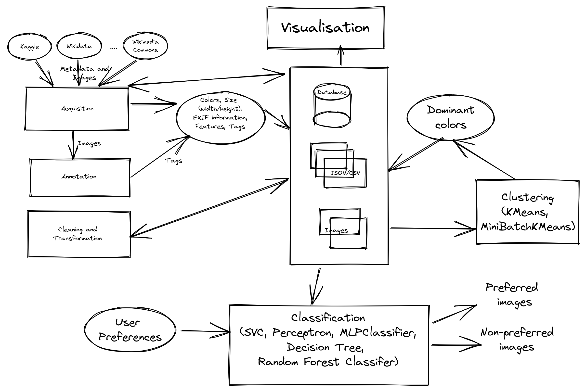

# Projet

## Objectifs

- Mise en place d'un [système de recommandation](https://en.wikipedia.org/wiki/Recommender_system) bien commenté en Python. 
  - Automatiser la collecte et l’annotation des images.
  - Analyser les données pour identifier des tendances.  
  - Visualiser efficacement les résultats de l’analyse.  
  - Construire et valider un système de recommandation.  
  - Effectuer des tests approfondis de tous les composants.  
- Présenter les résultats dans un rapport détaillé.  

L'objectif de ce projet est de recommander des images en fonction des préférences
de l'utilisateur. Vous disposez de trois séances pratiques pour construire ce système. Vous devez vous assurer que toutes les tâches liées à l'acquisition, l'annotation, l'analyse et la visualisation des données sont automatisées.

Les principales tâches du projet sont présentées ci-dessous :

1.  Collecte de données
2.  Étiquetage et annotation
3.  Analyses de données
4.  Visualisation des données
5.  Système de recommandation
6.  Tests
7.  Rapport

## Collecte de données

Vous devez collecter et télécharger un ensemble d'images. Vous avez les tâches suivantes à programmer, en automatisant le processus autant que possible :

1.  Créer un dossier appelé *images*.
2.  Télécharger les images sous licence ouverte dans le dossier *images* (minimum 100
    images).
3.  Enregistrez les métadonnées de chaque image comme la taille de l'image, le format de l'image (.jpeg,
    .png, etc.), l'orientation de l'image (paysage, portrait, carré, etc.),
    date de création, modèle d'appareil photo, etc. dans un ou plusieurs fichiers JSON. Vous pouvez utiliser les informations [Exif](https://en.wikipedia.org/wiki/Exif) présentes dans les fichiers d'images.

## Étiquetage et annotation

Pour cette tâche, vous devez rechercher les sources disposant d'informations supplémentaires
comme les balises, les catégories, etc.

Dans cette tâche, vous devrez peut-être étiqueter, annoter et enregistrer
des informations sur chaque image. Vous pouvez analyser les images en utilisant
des algorithmes de regroupement pour trouver les couleurs prédominantes.

Vous disposez déjà de certaines métadonnées provenant de l'EXIF des images de la précédente
tâche. Dans cette tâche, votre objectif est d'obtenir des informations supplémentaires, comme
les couleurs prédominantes, les tags. Et si vous demandiez aux utilisateurs de tagger les images ?
Par exemple, les noms de couleurs, \#cat, \#fleur, \#sous-fleur, rose etc.

Comment prévoyez-vous de traiter ces tags ? Est-il possible d'automatiser ce
processus ?

## Analyses de données

Demandez à l'utilisateur de sélectionner quelques images et d'ajouter des balises. Pour chaque utilisateur, vous êtes
maintenant prêt à construire un profil de préférences d'utilisateur, basé sur cette sélection.
Vous pouvez recueillir les informations suivantes manuellement, mais l'objectif de
cette tâche consiste à les obtenir en utilisant les images sélectionnées de manière automatisée : 

1.  Couleurs préférées
2.  Orientation de l'image préférée
3.  Tailles d'images préférées (vignettes, grandes images, images de taille moyenne
    images, etc.)
4.  Balises favorites
5.  \...

Maintenant, grâce à votre connaissance des différents types de classificateurs et
les algorithmes de regroupement, quelles informations supplémentaires ajouterez-vous pour chaque
image ?

Votre prochain objectif est d'analyser les informations des utilisateurs et leur
les images préférées. Comment avez-vous créé des utilisateurs aléatoires ? Combien d'utilisateurs avez-vous
créer ? Quelles informations avez-vous stockées pour chaque utilisateur ? Quels types d'analyses avez-vous effectuées ?

## Visualisation des données

Dans cette tâche, votre objectif est de visualiser les différentes caractéristiques de
toutes les images téléchargées.

1.  Le nombre d'images disponibles pour chaque année
2.  Le nombre d'images disponibles pour les différents types : taille de l'image,
    l'orientation des images, les modèles d'appareils photo, etc. 
3.  Caractéristiques des couleurs

Les utilisateurs peuvent également visualiser les informations ci-dessus relatives à leurs images préférées. Dans cette tâche, vous devez également ajouter une fonctionnalité permettant aux utilisateurs de visualiser les informations liées à leur propre profil d'utilisateur.

## Système de recommandation

Êtes-vous maintenant prêt à recommander des images à un utilisateur ? Dans cette tâche, votre objectif est de construire le système de recommandation. Quelle approche avez-vous décidé de prendre ? Filtrage collaboratif, basé sur le contenu ou une approche hybride ? Quel(s) algorithme(s) avez-vous choisi (classification, clustering, ...) ? Pour chaque utilisateur, êtes-vous maintenant en mesure de construire une profil ? Quel type d'information avez-vous utilisé pour établir un profil d'utilisateur profil ? Qu'est-ce qui manque ? Quelles sont les limites de votre proposition ?

## Tests

Votre prochaine tâche consiste à mettre au point et à effectuer différents tests sur votre proposition système. Les différentes fonctions sont-elles fonctionnelles ? Comment avez-vous testé votre projet ? Comment vérifiez-vous que votre système de recommandation fonctionne ?

## Rapport

Votre tâche finale consiste à préparer un rapport de 5 pages sur le projet (en français ou en anglais) en format PDF, qui détaille les points suivants :

- Le but de votre projet
- Sources des données de vos images et leurs licences.
- Taille de vos données.
- Informations que vous avez décidé de stocker pour chaque image.
- Informations concernant les préférences de l'utilisateur
- Les modèles d'exploration de données et/ou d'apprentissage machine que vous avez utilisés avec les métriques obtenues.
- l'auto-évaluation de votre travail.
- Remarques concernant les séances pratiques, les exercices et les possibilités d'amélioration.
- Conclusion

**Note** : Veuillez n'ajouter aucun programme (ou code) dans ce rapport.

## Soumission

- Veuillez **ne pas** soumettre vos images.
- Renommez votre rapport de projet sous le nom de Nom1\_Nom2\_\[Nom3\].pdf, où Nom1, Nom2, etc. sont vos noms.
- Ajoutez votre rapport de projet dans votre dossier de projet.
- Compressez et renommez votre travail de projet comme Nom1\_Nom2\_\[Nom3\].zip, où Nom1, Nom2 sont vos noms.
- Soumettez votre **projet** en ligne.

## Évaluation

Les critères d'évaluation des projets sont indiqués ci-dessous : 

1.  Collecte de données
    1. Approches automatisées de la collecte de données
    2. Utilisation d'images sous licence libre
    3. Stockage et gestion des images et des métadonnées associées
2.  Étiquetage et annotation
    1. Approches automatisées de l'étiquetage
    2. Stockage et gestion des étiquettes et des annotations des images
    3. Utilisation d'algorithmes de classification et de regroupement
3.  Analyses de données
    1. Types d'analyses utilisées
    2. Utilisation de Pandas et Scikit-learn
    3. Utilisation d'algorithmes d'exploration de données
4.  Visualisation des données
    1. Types de techniques de visualisation utilisées
    2. Utilisation de matplotlib
5.  Système de recommandation
    1. Stockage et gestion des préférences et du profil de l'utilisateur
    2. Utilisation d'algorithmes de recommandation
6.  Tests
    1. Présence de tests fonctionnels
    2. Présence de tests utilisateurs
7.  Rapport
    1. Clarté de la présentation
    2. Présence d'une introduction et d'une conclusion claires, architecture
        des diagrammes, un résumé des différentes tâches réalisées et des limites
    3. Bibliographie

**Rémarque**: Vous pouvez consulter des [exemples supplémentaires](../../examples) de notebooks.
